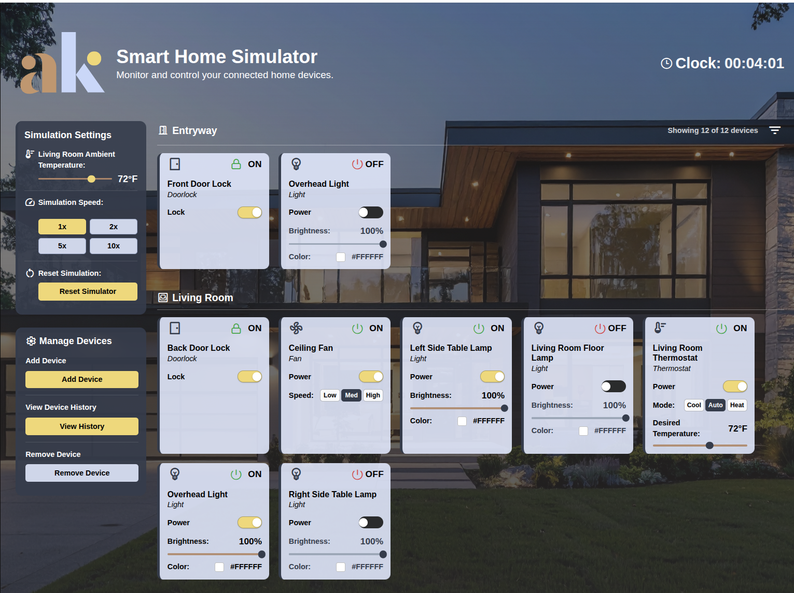

# Smart Home Simulator

## Team Size

Work completed by a team of two.

## Overview

The Smart Home Simulator is a full-stack application that models and controls household devices such as lights, fans, thermostats, and door locks.

Users can:

- View devices grouped by location
- Control device behavior (power, brightness, speed, lock state, temperature)
- Simulate environmental conditions (ambient temperature)
- Track device command history
- Interact with a RESTful API backend

This project demonstrates:

- SOLID principles
- Clean layered architecture
- Design patterns (State, Factory, Strategy)
- RESTful API design
- JSON-based persistence
- Validation and error handling best practices

---

## Architecture

The backend follows a layered architecture:

Controller Layer → HTTP handling and validation  
Service Layer → Business logic and orchestration  
Domain Layer → Core models and state machines  
Infrastructure Layer → JSON persistence

### Design Pattern Catalog

| Pattern                          | Classes / Files                                                                                                                                                                       | Why It Was Used                                                                                                                                                                                                                                                                                      |
| -------------------------------- | ------------------------------------------------------------------------------------------------------------------------------------------------------------------------------------- | ---------------------------------------------------------------------------------------------------------------------------------------------------------------------------------------------------------------------------------------------------------------------------------------------------- |
| State Pattern                    | `SmartHome.Domain/Devices/States/*`, including light, fan, thermostat, and door lock state classes                                                                                    | Each device has valid and invalid transitions. The State pattern keeps state-specific behavior out of controllers and services and makes transitions explicit. For example, a light can only change brightness while it is on, and a thermostat transitions between Off, Idle, Heating, and Cooling. |
| Factory Pattern                  | `IDeviceFactory`, `DeviceFactory`, `IDeviceTypeFactory`, `LightDeviceFactory`, `FanDeviceFactory`, `ThermostatDeviceFactory`, `DoorLockDeviceFactory`                                 | Device creation is centralized instead of scattered through controllers. This supports the Open-Closed Principle because new device types can be added through new factories rather than changing controller logic.                                                                                  |
| Strategy Pattern                 | `IThermostatModeStrategy`, `HeatModeStrategy`, `CoolModeStrategy`, `AutoModeStrategy`, `ThermostatModeStrategyFactory`                                                                | Thermostat behavior changes depending on mode. Heat, Cool, and Auto each decide differently whether the thermostat should heat, cool, or remain idle. Strategy keeps this logic interchangeable without large conditional blocks inside the thermostat.                                              |
| Repository Pattern               | `IDeviceRepository`, `ILocationRepository`, `JsonRepository`                                                                                                                          | Persistence is hidden behind interfaces so the service layer does not directly depend on JSON file handling. This keeps business logic separate from storage details and would allow JSON persistence to be replaced later with a database repository.                                               |
| Command Pattern                  | `IDeviceCommand`, `DeviceCommand`, `TogglePowerCommand`, `SetBrightnessCommand`, `SetFanSpeedCommand`, `SetThermostatModeCommand`, `SetTargetTemperatureCommand`, `ToggleLockCommand` | Device actions are represented as command objects. This makes each operation reusable, testable, and easy to log in command history. The command history stores what operation was performed and when.                                                                                               |
| Dependency Injection             | `Program.cs` service registrations                                                                                                                                                    | Services, repositories, factories, validators, and controllers receive dependencies through constructor injection. This avoids service locator behavior and keeps classes testable.                                                                                                                  |
| Global Error Handling Middleware | `GlobalExceptionHandlingMiddleware`                                                                                                                                                   | Error handling is centralized instead of repeated in every controller. Domain and validation errors are converted into consistent `application/problem+json` responses without leaking stack traces or internal details.                                                                             |
| DTO / Mapper Pattern             | API DTOs and mapper classes such as `DeviceMapper` and `CommandHistoryMapper`                                                                                                         | The API layer does not expose domain objects directly. Mappers translate domain models into response DTOs, keeping HTTP concerns separate from domain logic.                                                                                                                                         |

---

## Running the Application

### Prerequisites

- Docker
- Docker Compose

### Run (recommended)

```bash
docker compose up --build
```

### Stop the application

```bash
docker compose down
```

---

## Access Points

- Frontend: http://localhost:4200
- Swagger: http://localhost:5001/swagger

---

## Running Tests

### Unit Testing:

`dotnet test backend/tests/SmartHome.Domain.Tests`

### Backend Integration Testing:

Run tests from the backend/ directory with:

`dotnet test tests/SmartHome.Api.Tests/SmartHome.Api.Tests.csproj`

## Frontend Testing:

Run frontend component and service tests from:

```bash
cd frontend/smart-home-ui
ng test
```

### Bruno:

Integration/API testing is performed through the committed Bruno collection in `/bruno/SmartHome API`.

The collection includes requests for:

- device listing, filtering, registration, removal, and control
- invalid validation cases
- command history retrieval
- ambient temperature get/set
- simulation speed changes
- simulation reset
- thermostat, light, fan, and door lock workflows

Run the backend, open the Bruno collection, select the SmartHome API environment, and execute the requests in order.

```text
/bruno
```

To use:

1. Open Bruno
2. Open the `/bruno` folder
3. Run requests for:
   - Devices
   - Locations
   - Simulation
   - Command history

The collection includes both:

- Success cases
- Error cases

---

## Local Development (without Docker)

### Backend

```bash
cd backend/src/SmartHome.Api
dotnet run --launch-profile https
```

### Frontend

```bash
cd frontend/smart-home-ui
npm install
npm run build
```

### Frontend Build Verification

```bash
cd frontend/smart-home-ui
npm run build
```

---

## API Documentation (Swagger)

Swagger UI is available at:

http://localhost:5001/swagger

It provides:

- All endpoints
- Request/response schemas
- Interactive testing

---

## Persistence

SQLite/EF Core ORM experimentation is included as extra-credit work, but the active persistence implementation used by the application is JSON-based persistence through `JsonRepository`.

File location:

```text
/data/smarthome.json
```

Features:

- State persists across restarts
- Device dehydration and rehydration
- Seed data included

---

## Core Features



### Device Types

- Light (brightness, color)
- Fan (speed)
- Thermostat (mode, temperature, state machine)
- Door Lock (locked/unlocked)

### Supported Operations

- List devices
- Get device by ID
- Register device
- Delete device
- Control device state
- Set ambient temperature
- View command history

---

## Example API Endpoints

| Method | Endpoint                                        | Description                                             |
| ------ | ----------------------------------------------- | ------------------------------------------------------- |
| GET    | `/api/devices`                                  | Retrieve all registered devices with optional filtering |
| GET    | `/api/devices/{id}`                             | Retrieve a single device by ID                          |
| POST   | `/api/devices`                                  | Register a new smart home device                        |
| DELETE | `/api/devices/{id}`                             | Remove an existing device                               |
| PUT    | `/api/devices/{id}/state`                       | Update or control a device state                        |
| PUT    | `/api/locations/{location}/ambient-temperature` | Set the ambient temperature for a location              |
| GET    | `/api/devices/{id}/history`                     | Retrieve command history for a device                   |
| PUT    | `/api/simulation/speed`                         | Change the simulation speed multiplier                  |
| POST   | `/api/simulation/reset`                         | Reset all devices and simulation settings to defaults   |

---

## Repository Structure

```text
README.md
docker-compose.yml
.gitignore

/backend
  /src
    /SmartHome.Api
    /SmartHome.Domain
    /SmartHome.Infrastructure

  /tests
    /SmartHome.Domain.Tests
    /SmartHome.Api.Tests

/frontend
  /smart-home-ui
    /src
    package.json
    angular.json

/bruno

/data
  smarthome.json
```

---

## Demo & Architecture Walkthrough

Application Demo:
// TODO: [INSERT LINK]

Architecture Walkthrough:
// TODO: [INSERT LINK]

---

## Known Issues

The Angular frontend may log a non-blocking change detection warning related to the simulated clock. Core functionality is unaffected.
