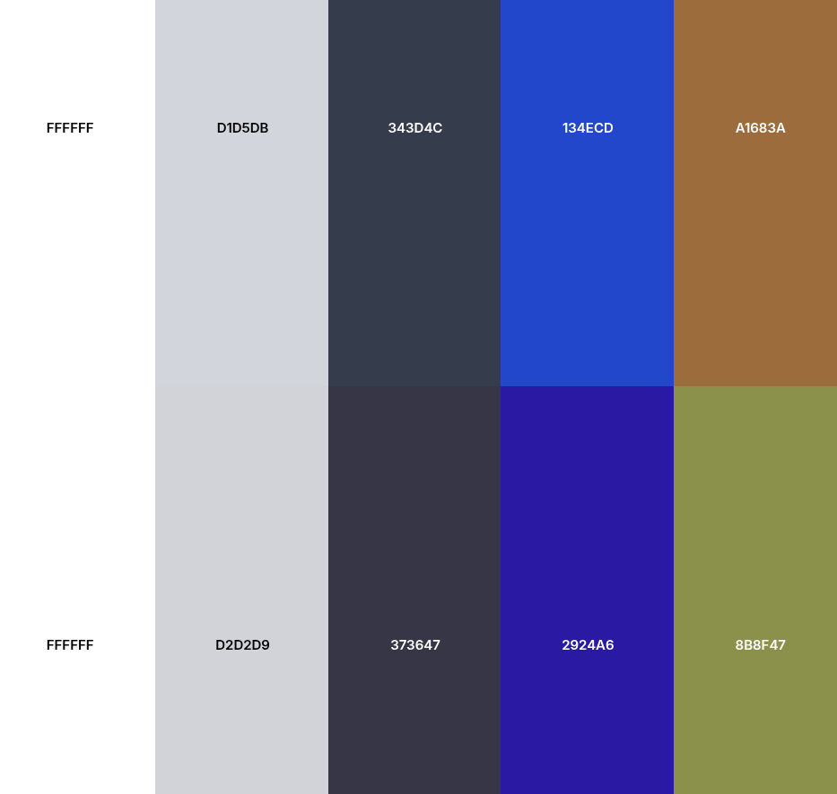

# UI Color System (Accessible Design)

This project uses a color palette designed for:

- Readability (WCAG contrast compliant)
- Color vision deficiency support (deuteranopia-friendly)
- Clear UI state separation (no reliance on red/green)

---

## Palette Preview

---

## Color Roles

| Purpose          | Color                | Usage                               |
| ---------------- | -------------------- | ----------------------------------- |
| Background       | `#FFFFFF`            | App background                      |
| Card Surface     | `#D1D5DB`            | Cards, panels                       |
| Primary Text     | `#343D4C`, `#000000` | Headings, body text                 |
| Action (Primary) | `#134ECD`,`#f1d576`  | Buttons, toggles, links             |
| State / Accent   | `#A1683A`, `#b58e75` | Active states, thermostat, emphasis |

---

## Design Principles

### Do not rely on color alone

All states must include:

- Text labels (e.g., **ON / OFF**)
- Icons (💡 🔒 🌡)

---

### Avoid Problematic Colors

The following are intentionally avoided:

- Green (collapses in deuteranopia)
- Red/Green combinations
- Yellow/Lime accents (shift unpredictably)
