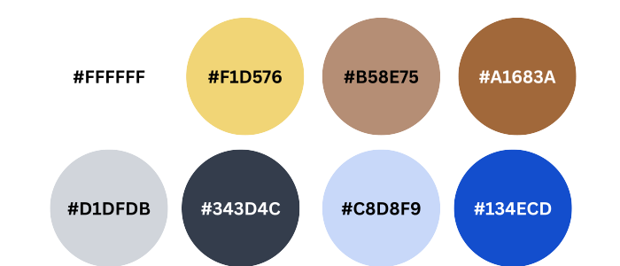

# UI Color System (Accessible Design)

This project uses a color palette designed for:

- High readability
- WCAG-aware contrast choices
- Deuteranopia-friendly differentiation
- Clear UI state separation without relying solely on color

---

## Palette Preview

---

## Color Roles

| Purpose          | Color                | Usage                               |
| ---------------- | -------------------- | ----------------------------------- |
| Background       | `#FFFFFF`            | App background                      |
| Card Surface     | `#D1D5DB`            | Cards, panels                       |
| Primary Text     | `#343D4C`, `#000000` | Headings, body text                 |
| Action (Primary) | `#134ECD`, `#F1D576` | Buttons, toggles, links             |
| State / Accent   | `#A1683A`, `#B58E75` | Active states, thermostat, emphasis |

---

## Design Principles

### Do not rely on color alone

All states must include:

- Text labels (e.g., **ON / OFF**)
- Icons (💡 🔒 🌡)

---

### Avoid Problematic Colors

The following are intentionally avoided:

- Red/green dependent status indicators
- Low-contrast yellow/lime UI accents on light backgrounds
